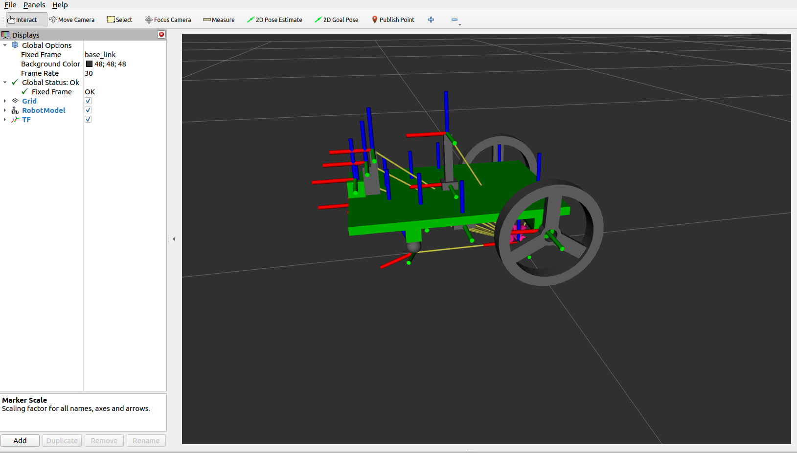
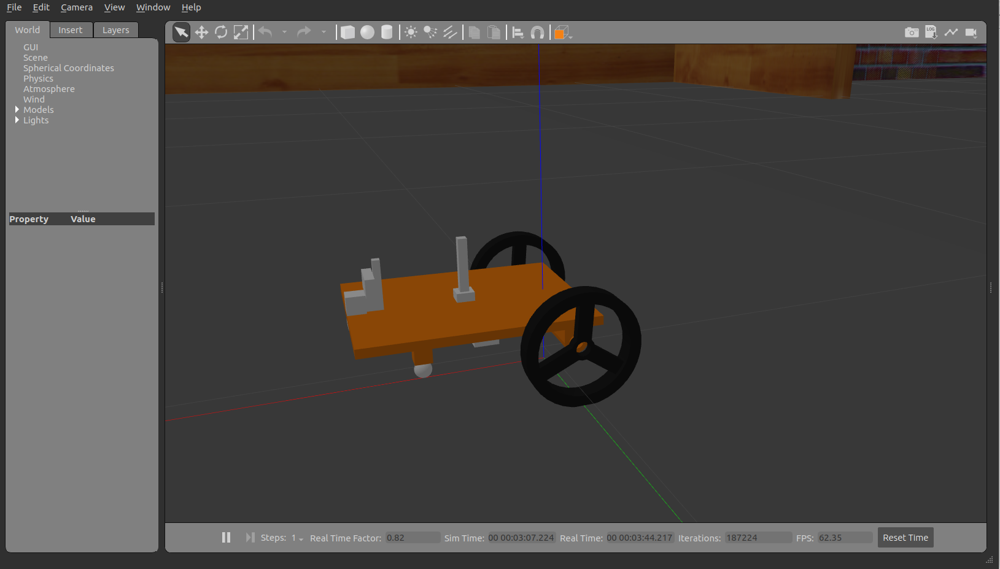

# Visualisation on RVIZ and simulation in Gazebo for mobile robot in ROS2
 The package contain mobile robot with different module attached with different design and texture added.
 
<br/>
<br/>

 (I)URDF
   1)model_pauli.urdf-Contains Robot body with different component attached.
   2)differential_drive.urdf-Contains Robot body with wheel movement attached for teleop.
   3)dd_lidar.urdf-Contains Robot body with Lidar module attached.
   4)c_dd_lidar.urdf-Contains Robot body with differential drive and Lidar attached for teleop and scan(SLAM).
   5)c_dd_imu.urdf-Contains Robot body with IMU sensor integrated.
   6)c_dd_fir.urdf-Contains Robot body with IR sensor integrated.
   7)c_dd_camera.urdf-Contains Robot body with monocular camera integrated.
   8)Xacro-
       (i)mode_pauli.xacro-Contains Robot body with xacro description for coloring of the component.
       (ii)model_pauli_colored.xacro-Defines the range of colors which are then taken into xacro.
       (iii)pauli_plugibs_gazebo.xacro-Contains the plugins for the sensor to be utilised in the gazebo.
       
  (II)Launch-the nomenclature of the launch file are linked with the urdf specified.
  (III)rviz-the nomenclature of the rviz file are linked with the urdf specified.
  (IV)config-Contains the joint configuration of the robot model.
  (V)Buidding_model-Contains model of the maze in sdf file.
  (VI)worlds-The model file in sdf is imported in the world format along with ground and sun addition.
<br/>

## Prequisite And Dependencies
To use the robot:**pauli_package**, Ensure, <br/>***First***,ROS2 Humble is installed on your PC and you have a bit of familiarity with installing ROS packages. Refer to the official ROS 2 documentation for installation instructions: https://docs.ros.org/en/humble/Installation.html <br/> <br/>***Second***, You have the following packages installed or you can install them again if you're unsure

- update and upgrade your ubuntu repos and packages
  ```shell
  sudo apt update && sudo apt upgrade
  ```
- gazebo simulator and packages and ros2 control
  ```shell
  sudo apt install ros-humble-gazebo-ros-pkgs

  sudo apt install ros-humble-gazebo-ros2-control
  ```
- xacro
  ```shell
  sudo apt install ros-humble-xacro
  ```
- robot_state_publisher for publishing robot urdf transform and joint_state_publisher for publishing sim joint values
  ```shell
  sudo apt install ros-humble-robot-state-publisher

  sudo apt install ros-humble-joint-state-publisher
  sudo apt install ros-humble-joint-state-publisher-gui
  ```
<br/>
<br/>

## Setting up the Robot:
- Clone the repository into your ROS 2 workspace:

  ```shell
  cd /PATH_TO_ROS_WS/src

  git clone [Update Link]
  ```

- Build the ```pauli``` package:

  ```shell
  colcon build --symlink-install --packages-select pauli
  ```
- Source your ROS2 workspace(recommended: add to ~/.bashrc and source ~/.bashrc)

  ```shell
  source /PATH_TO_ROS_WS/install/setup.bash
  ```
<br/>
<br/>

## Model and Launch File Naming Convention:

### The naming convention for the URDF models reflects the sensors or plugins they contain, :

  -  model_pauli: Base model without specific sensors.
  -  differential_drive: Includes differential drive for teleoperation.
  -  dd: Includes differential drive
  -  lidar: Includes LiDAR sensor.
  -  c_: Prefix signifying "combined" functionality (Gazebo simulation and RVIZ visualization).
  -  imu: Suffixes indicating the presence of an Inertial Measurement Unit (IMU).
  -  fir: Suffixes indicating the presence of a Forward IR Sensor.
  -  camera: Suffixes indicating the presence of Camera Sensor.

### The launch file names follow a convention to indicate their functionality:
  -  r*: Launch files starting with "r" launch the model for RVIZ visualization.
  -  g*: Launch files starting with "g" launch the model in Gazebo simulation.
  -  c*: Launch files starting with "c" combine both functionalities, launching the model in Gazebo and displaying it in RVIZ simultaneously.

## Launching the Robot:
**Visualize URDF in RVIZ:**

  ```shell
  ros2 launch pauli rmodel_xacro.launch.py
  ```
  
**Spawn Model in Gazebo (with Maze world):**

  ```shell
  ros2 launch pauli gmodel_xacro.launch.py
  ```
  
**Visualize in RVIZ and Spawn Model in Gazebo:**

  ```shell
  ros2 launch pauli cmodel_xacro.launch.py
  ```
<br/>